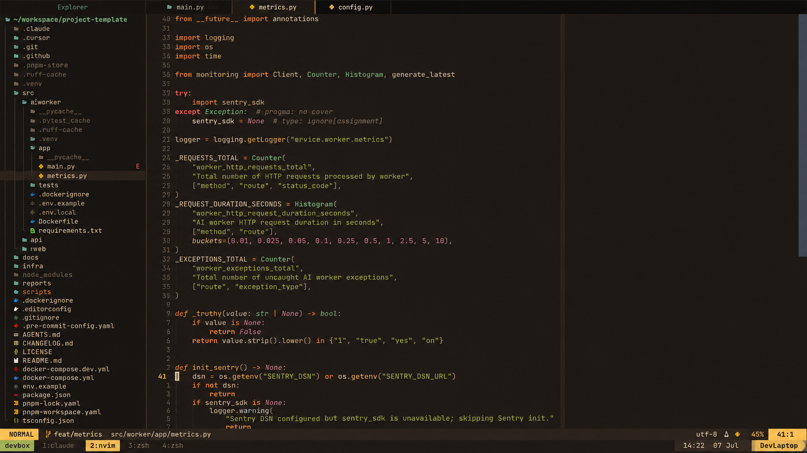

# Emberbox.nvim

A warm dark Neovim colorscheme inspired by Gruvbox, rebuilt with a darker modern UI and consistent syntax hierarchy.

Emberbox uses warm brown/charcoal backgrounds, cream foreground text, yellow functions, orange keywords, green strings, aqua types, purple constants, and muted beige members/properties.

## Preview



## Installation

### lazy.nvim

```lua
{
  "MuhammedZohaib/emberbox.nvim",
  lazy = false,
  priority = 1000,
  config = function()
    vim.cmd.colorscheme("emberbox")
  end,
}
```

### packer.nvim

```lua
use({
  "MuhammedZohaib/emberbox.nvim",
  config = function()
    vim.cmd.colorscheme("emberbox")
  end,
})
```

### vim-plug

```vim
Plug 'MuhammedZohaib/emberbox.nvim'
colorscheme emberbox
```

## Manual Usage

```lua
vim.o.termguicolors = true
vim.cmd.colorscheme("emberbox")
```

## Extras

### iTerm2

Import:

```text
extras/iterm/Emberbox.itermcolors
```

In iTerm2:

```text
Settings -> Profiles -> Colors -> Color Presets -> Import
```

### tmux

Copy or source:

```text
extras/tmux/emberbox.tmux
```

Example:

```tmux
source-file ~/.config/tmux/emberbox.tmux
```

## Palette

| Name       | Hex       |
| ---------- | --------- |
| Background | `#211a16` |
| Foreground | `#e6d6b8` |
| Orange     | `#e78a4e` |
| Yellow     | `#e0b45c` |
| Green      | `#a9b665` |
| Aqua       | `#89b482` |
| Blue       | `#7daea3` |
| Purple     | `#d3869b` |
| Red        | `#ea6962` |
| Beige      | `#c7ad83` |

## License

MIT
